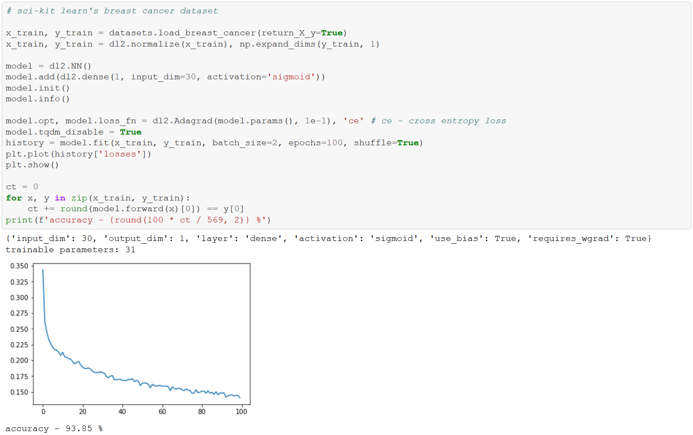
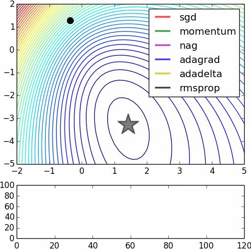
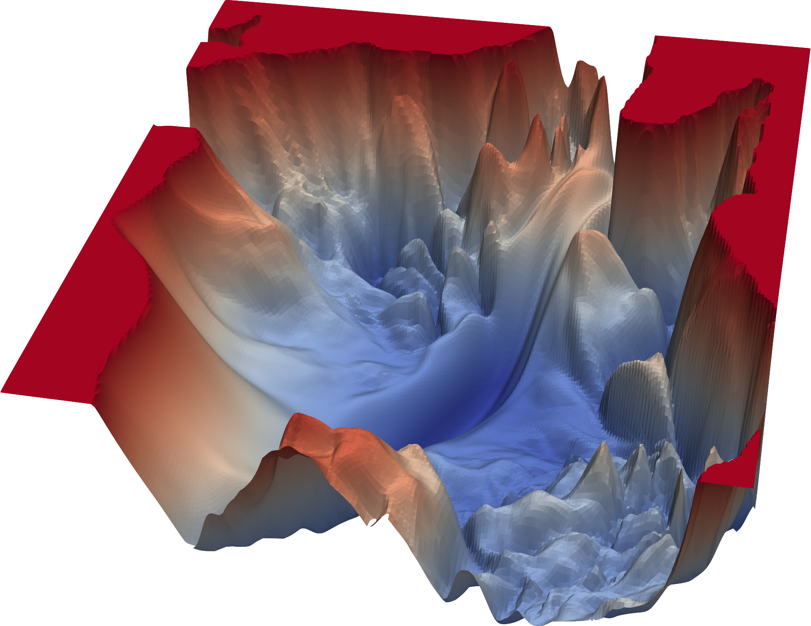

# dl.py - a small neural network library
dl is a small library I made to understand how neural networks and gradient descent optimizers work. It's quite simple and doesn't support CNNs. I have implemented the standard backpropagation algorithm (shown below). Gradient descent optimizers like SGD, Momentum, Adam, RMSprop and Adagrad can be used for training. 

# dl2.py - an even better neural network library
dl2 is dl but with convolution, transpose convolution, sub-sampling and super-sampling layers with a Keras-like API. It uses Numba to accelerate NumPy computations but even with fewer parameters than MLPs, CNNs seem to perform slower as the convolution operation is not optimized. dl2 uses the standard backpropagation algorithm for MLPs (Multi-Layer Perceptrons) but also supports backpropagation through convolution, transpose convolution, sub-sampling and super-sampling layers (can be used for making GANs and auto-encoders!). For the same neural net architecture, TensorFlow and PyTorch still seem to beat neural net operations written in pure NumPy (which is what my library does). dl2 uses XAVIER initialization and supports most GD optimizers (we can add more if we want). 

  TensorFlow and Pytorch utilize reverse-mode differentiation in arbitrary DAGs (a DAG is created during the forward pass and the operations are kept track of - such a DAG is called as a Dynamic Computational Graph - DCG). We can make arbitrary DAGs in dl2 by using multiple neural networks, custom loss functions and custom backpropagation (i.e, backpropagation for individual neural network is done automatically - but we need to pass the gradient between various neural networks manually - GAT-dl2.ipynb is an example). Libraries like TensorFlow and Pytorch make it very easy to implement neural networks and related algorithms. They let us treat neural networks as black boxes. However, in order to fully understand the limitations and ways to improve performance of neural net architectures or algorithms, I felt I had to implement them myself. I realized how challenging it can be to train neural nets!

#### Things I've learnt -
1. As part of this project I learnt multivariable calculus and some linear algebra - ML involves convex optimization and a whole LOT of matrices...personally, the fact that "learning" <=> optimizing an objective function <- I find it really elegant :')...

2. Backpropagation to up-sampling and transpose convolution is computationally similiar to sub-sampling and convolution layers...I would have implemented them earlier if I had realized this...

3. Convolutional neural networks are simply sparse multi-layer perceptrons. If convolution layers are fully-connected we will be able to learn more features but the number of operations to get through a single convolution layer will explode. Image below from Chris Olah's blog.

4. Implementing batch normalization - I understood how the forward pass worked (you normalize, scale and then shift) but I only later understood the derivation of the backward pass after working out the gradient for small layers and going through some blogposts. Below is the batch-norm computational graph. 

# demo.ipynb - how dl2 works

#### Linear regression using dl2 -

#### Logistic regression using dl2 -

#### Polynomial regression using dl2 - 
![]

#### Implementing gradient descent optimizers using dl2 -

In TensorFlow, we can simply do opt = optimizers.Adam(...). Here, each optimizer is a class and we store the gradient and the updated parameters. Calling the step() method updates the parameters (which is done differently for every optimizer) and returns them. For a neural network, the parameters that we pass into the optimizer are the weights and biases of the network. We can use the optimizer class to learn any set of parameters (of arbitrary shape). The parameters have to be NumPy arrays. 

*Below, we have a function of the form f(x) = N1(p(x) + **w**N2(x)) where p is a polynomial and N1 and N2 are neural networks and **w** is parameter - we compute the gradient of the loss function w.r.t to all the parameters of f do gradient descent...*

# UAT-dl2.ipynb

#### Universal Approximation Theorem -

# GATES-dl.ipynb - modelling logic gates using neural networks
A classic problem in machine learning is using a neural network to model XOR. XOR is not a linearly separable function - and neural networks are good at approximating non-linear transformations. Logic gates have binary inputs but neural networks can have real inputs. So not only can we input 0 and 1, but all pairs of numbers in the range [0, 1] (with finite step size - say, 0.01). The contour plots of the corresponding outputs are shown below. Black regions and beyond => 1 and yellow regions and beyond => 0. In the plots, we can clearly see boundaries (black -> yellow) where the output jumps from 1 to 0 and 0 to 1.

# GANs
Generative Adversarial Networks belong to a class of machine learning models called generative models. Generative models are used to learn data distributions using unsupervised learning. GANs were introduced in 2014 by Goodfellow et al. GANs can be used to do some really cool things - they can be used to [make art](https://heartbeat.fritz.ai/artificial-art-how-gans-are-making-machines-creative-b99105627198), [make life-like human faces](https://www.whichfaceisreal.com/), [make life-like human figures and models](https://rosebud.ai/) and even [learn the rules of a video game and recreate it](https://blogs.nvidia.com/blog/2020/05/22/gamegan-research-pacman-anniversary/) by using pixel information alone! 

#### Gradient flow for a simple GAN -

# GAN-tf.ipynb
My implementation of a GAN trained using TensorFlow and the MNIST data set. 

#### Evolution through epochs -

# GAT-dl2.ipynb
My implementation of the GAN training algorithm using dl2. 

#### The GAN training algorithm from the original paper -

# CNN-MLP-benchmarks-dl2.ipynb
Implementation of CNN and MLP MNIST classifiers using dl2. Here, I compare the accuracies of various gradient descent optimizers (SGD, Momentum, RMSprop, Adam and Adagrad).

#### Different optimizers reach a local minima at different rates -

# LENET5-cifar10-dl2.ipynb
LeNet-5 trained on the cifar10 dataset. There are 10 classes and 60000 32x32x3 RGB images. I got a classification accuracy of about 60% after an hour and a half of training. We can get significantly better results using TensorFlow (94% accuracy in 2 minutes is possible with Google Colab’s TPUv2). 

#### The LeNet-5 CNN architecture -

#### Some images from the cifar10 -

#### Loss landscape of ResNet-10 trained on cifar10 -

# References
1. [neuralnetworksanddeeplearning.com](neuralnetworksanddeeplearning.com)
2. [MIT 6.S191: Introduction to Deep Learning](http://introtodeeplearning.com/)
3. [Stanford CS231n: Convolutional Neural Networks](http://cs231n.stanford.edu/)
4. [Generative Adversarial Networks](https://arxiv.org/abs/1406.2661)
6. [Why Momentum Really Works](https://distill.pub/2017/momentum/)
7. [An Overview of Gradient Descent Optimizers](https://ruder.io/optimizing-gradient-descent/)
8. [Understanding Convolutions](https://colah.github.io/posts/2014-07-Understanding-Convolutions/)
9. [Calculus on Computational Graphs](https://colah.github.io/posts/2015-08-Backprop/)
11. [Automatic Reverse-Mode Differentiation](http://www.cs.cmu.edu/~wcohen/10-605/notes/autodiff.pdf)
12. [Universal Approximation Theorem](https://en.wikipedia.org/wiki/Universal_approximation_theorem#:~:text=In%20the%20mathematical%20theory%20of,given%20function%20space%20of%20interest.)
13. [Batch Normalization: Accelerating Deep Network Training by Reducing Internal Covariate Shift](https://arxiv.org/abs/1502.03167)
14. [Batch Normalization Gradient Flow](http://cthorey.github.io./backpropagation/)
