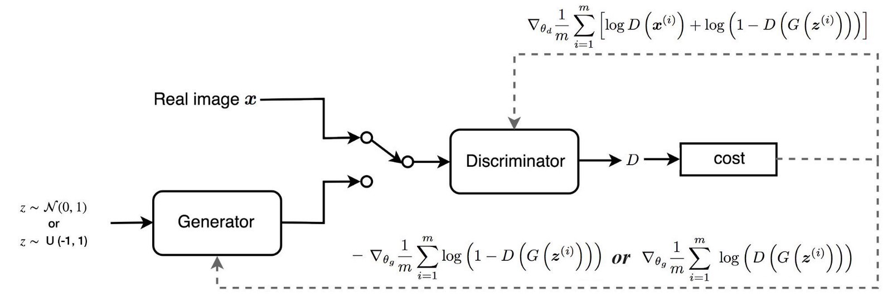
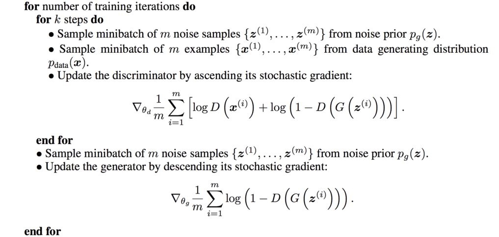

## dl.py
dl is a small library I made to understand how neural networks and gradient descent optimizers work. I have benchmarked SGD, momentum, RMSprop, Adam and Adagrad (with XAVIER and HE intialization) on MNIST and used dl for simple problems like modelling logic gates. dl can also be used to implement reinforcement learning algorithms like REINFORCE or DQL for simple games in OpenAI's gym environment (CartPole-v0, Pong-v0, Pacman-v0 etc) or grid-world games. dl uses the standard backpropagation algorithm (shown below) for MLPs. I implemented softmax activation after figuring out how to compute the gradient of loss function w.r.t softmax layer input/output. Softmax works much better than sigmoid for classification! Libraries like PyTorch and Tensorflow use reverse mode differentiation. In RMD, all operations done on variables are kept track of (represented as a DAG), and calling the backward() (gradient(loss, parameters) in TensorFlow) method on the output scalar computes the gradient of that scalar w.r.t all the variables.

## dl2.py
dl2 is dl but with convolution, transpose convolution, sub-sampling and super-sampling layers. Has a Keras-like (kinda :')) API. It used Numba to accelerate NumPy computations but even with fewer parameters than a MLP, CNNs seem to perform slower as the convolution operation is not optimized. dl2 uses the standard backpropagation algorithm for MLPs but also supports convolution, transpose convolution, sub-sampling and super-sampling (can be used for making GANs and auto-encoders!). For the same neural net architecture, TF and PyTorch still seem to beat neural net operations written in pure NumPy. Uses XAVIER and HE initialization and supports most GD optimizers (we can add more if we want).  

## GATES.ipynb - modelling logic gates using NNs
A classic toy problem in machine learning is using a neural network to model XOR. XOR is not a linearly separable function - and neural networks are good at approximating non-linearly separable data. Logic gates have binary inputs but neural networks can have real inputs. So not only can we input 0 and 1, but all pairs of numbers in the range [0, 1] (with finite step size - here, it's 0.01). The contour plots of the corresponding outputs are shown below. Black regions and beyond => 1 and yellow regions and beyond => 0. In the plots, we can clearly see boundaries (black->yellow) where the output jumps from 1 to 0 and 0 to 1.

For XOR, (0, 0) => 0, (1, 0) => 1, (0, 1) => 1 and (1, 1) => 0 as it should be.

## GANs
Generative Adversarial Networks belong to a class of machine learning models called generative models. Generative models are used to learn data distributions using unsupervised learning. GANs were introduced in 2014 by Goodfellow et al. They can be used to create novel data. For example, given images of digits, GANs can be used to create different variations of digits. The cool thing about GANs is that the generator in a GAN takes in noise as input and spits out sensible looking images. There are many AWESOME uses for GANs. They can be used to create "filler" data to balance data sets with inequal ratios of training examples. They can be used to [make art](https://heartbeat.fritz.ai/artificial-art-how-gans-are-making-machines-creative-b99105627198), [make life-like human faces](https://www.whichfaceisreal.com/), [make life-like human figures and models](https://rosebud.ai/) and even [learn the rules of a video game and recreate it](https://blogs.nvidia.com/blog/2020/05/22/gamegan-research-pacman-anniversary/) by using pixel information alone! 

## GANtf.ipynb
GAN TensorFlow implementation

## Convolutions1.ipynb and Convolutions2.ipynb
Simple CNN implementations. No ML libraries used - forward and backward pass using pure NumPy. Forward and backward pass of the implementation is a bit different from usual CNN implementation. It achieved a mere 90% accuracy on MNIST and it took about an hour to train. 
