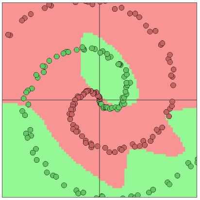

# dl.py - a small neural network library
dl is a small library I made to understand how neural networks and gradient descent optimizers work. It's quite simple and doesn't support CNNs. I have implemented the standard backpropagation algorithm (show below). Gradient descent optimizers like SGD, Momentum, Adam, RMSprop and Adagrad can be used for training. 

# dl2.py - an even better neural network library
dl2 is dl but with convolution, transpose convolution, sub-sampling and super-sampling layers with a Keras-like API. It uses Numba to accelerate NumPy computations but even with fewer parameters than MLPs, CNNs seem to perform slower as the convolution operation is not optimized. dl2 uses the standard backpropagation algorithm for MLPs but also supports backpropagation through convolution, transpose convolution, sub-sampling and super-sampling layers (can be used for making GANs and auto-encoders!). For the same neural net architecture, TensorFlow and PyTorch still seem to beat neural net operations written in pure NumPy (which is what my library is). dl2 uses XAVIER initialization and supports most GD optimizers (we can add more if we want). TensorFlow and Pytorch utilize reverse-mode differentiation in arbitrary DAGs (a DAG is created during the forward pass and the operations are kept track of - such a DAG is called as a Dynamic Computational Graph (DCG)). We can make arbitrary DAGs in dl2 by using multiple neural networks, custom loss functions and custom backpropagation (i.e, backpropagation for individual neural network is done automatically - but we need to pass the gradient between various neural networks manually - GAT-dl2.ipynb is an example). 

#### Convolution 

# CYBENKO's-THEOREM-dl2.ipynb
Cybenko's theorem states that neural networks with single hidden layers are universal function approximators. However, it's actually quite hard to model functions with a single hidden layer. 

# GATES-dl.ipynb - modelling logic gates using neural networks
A classic toy problem in machine learning is using a neural network to model XOR. XOR is not a linearly separable function - and neural networks are good at approximating non-linear transformations. Logic gates have binary inputs but neural networks can have real inputs. So not only can we input 0 and 1, but all pairs of numbers in the range [0, 1] (with finite step size - say, 0.01). The contour plots of the corresponding outputs are shown below. Black regions and beyond => 1 and yellow regions and beyond => 0. In the plots, we can clearly see boundaries (black -> yellow) where the output jumps from 1 to 0 and 0 to 1.

# GANs
Generative Adversarial Networks belong to a class of machine learning models called generative models. Generative models are used to learn data distributions using unsupervised learning. GANs were introduced in 2014 by Goodfellow et al. GANs can be used to do some really cool things - they can be used to [make art](https://heartbeat.fritz.ai/artificial-art-how-gans-are-making-machines-creative-b99105627198), [make life-like human faces](https://www.whichfaceisreal.com/), [make life-like human figures and models](https://rosebud.ai/) and even [learn the rules of a video game and recreate it](https://blogs.nvidia.com/blog/2020/05/22/gamegan-research-pacman-anniversary/) by using pixel information alone! 

#### Gradient flow for a simple GAN

# GAN-tf.ipynb
My implementation of a GAN using TensorFlow. 

#### Evolution through epochs

# GAT-dl2.ipynb
My implementation of adversarial training using dl2.

#### The GAN training algorithm from the original paper

# CNN-MLP-benchmarks-dl2.ipynb
CNN + MLP implementation using dl2 to train an MNIST classifier. Here, I compare the performances of various gradient descent optimizers on MLPs and CNNs. It took me a while to figure out backpropagation through convolution, transpose convolution, pooling (sub-sampling) and transpose pooling (super-sampling) layers. 

#### Different optimizers reach a local minima at different rates

#### The LeNet-5 CNN architecture

# References
1. [neuralnetworksanddeeplearning.com1](neuralnetworksanddeeplearning.com)
2. [MIT 6.S191: Introduction to Deep Learning2](http://introtodeeplearning.com/)
3. [Stanford CS231n: Convolutional Neural Networks](http://cs231n.stanford.edu/)
4. [Generative Adversarial Networks](https://arxiv.org/abs/1406.2661)
6. [Why Momentum Really Works](https://distill.pub/2017/momentum/)
7. [An Overview of Gradient Descent Optimizers](https://ruder.io/optimizing-gradient-descent/)
8. [Understanding Convolutions](https://colah.github.io/posts/2014-07-Understanding-Convolutions/)
9. [Calculus on Computational Graphs3](https://colah.github.io/posts/2015-08-Backprop/)
10. [Gradient-Based Learning Applied to Document Recognition](http://yann.lecun.com/exdb/publis/pdf/lecun-01a.pdf)
11. [Automatic Reverse-Mode Differentiation](http://www.cs.cmu.edu/~wcohen/10-605/notes/autodiff.pdf)
12. [Universal Approximation Theorem](https://en.wikipedia.org/wiki/Universal_approximation_theorem#:~:text=In%20the%20mathematical%20theory%20of,given%20function%20space%20of%20interest.)
13. [GAN hacks](https://github.com/soumith/ganhacks)
14. [Batch Normalization: Accelerating Deep Network Training by Reducing Internal Covariate Shift](https://arxiv.org/abs/1502.03167)
15. [The Softmax function and it's derivative4](https://eli.thegreenplace.net/2016/the-softmax-function-and-its-derivative/)

*1. I could have watched 3b1b's deep learning videos, but I wanted to learn it without someone explaining it to me - this website was great!*

*2. Introduced me to Hebbian learning - very interested in alternatives to backpropagation...*

*3. Realized that forward mode differentiation is different from numerical/symbolic methods of computing derivatives - very elegant!*

*4. The website didn't really go over how to actually compute the softmax gradient matrix - after some fiddling around, I figured it out by myself. All we need to do is compute the outer product of softmax layer with itself, multiply by negative one, multiply trace of the square matrix by 2, take the sum of elements in each row. We end up with the derivative of the objective function w.r.t inputs of the softmax layer (a.k.a error in the softmax layer). Then you backpropagate the error as usual...*
