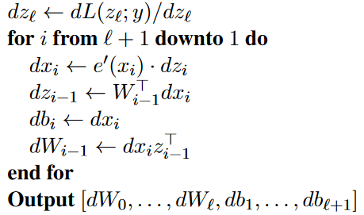

### dl.py
dl is a small library I made to understand how neural networks and gradient descent optimizers work. I have benchmarked momentum, Adam and RMSprop on MNIST and used dl for simple problems like modelling logic gates. dl can also be used to implement reinforcement learning algorithms like REINFORCE or DQL for simple games in OpenAI's gym environment like CartPole-v0, Pong-v0, Pacman-v0 etc or gridworld games. dl uses the standard backpropagation algorithm (shown below) for dense networks. Libraries like PyTorch (or TensorFlow's GradientTape()) on the other hand, uses reverse mode differentiation, in which all operations done on variables are kept track of and calling .backward() (or .gradient(loss, parameters) in TensorFlow) method on the output scalar (which is usually a loss value) computes the gradient w.r.t all the variables.

### GATES.ipynb - modelling logic gates using NNs

### tfGAN.ipynb - GANs and MNIST using TensorFlow!

